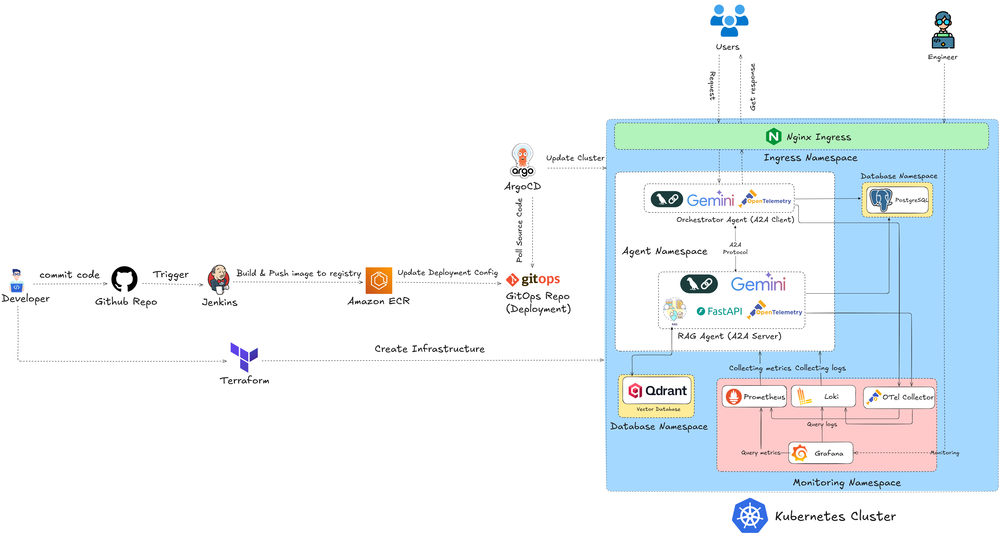
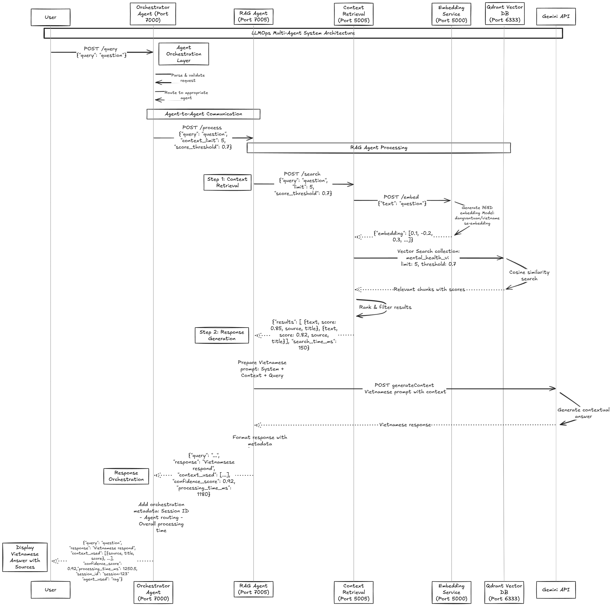

# LLMOps - Multi Agents - A2A 

## 1. Tổng quan về hệ thống

### 1.1. Kiến trúc tổng quan của hệ thống

### 1.2. Các công nghệ sử dụng
#### Cloud, Automation và Microservice
| Thành phần | Công nghệ |
|-----------|-----------|
| **Source code** | GitHub |
| **CI/CD** | Jenkins |
| **API** | FastAPI |
| **Containerize** | Docker |
| **Container Orchestration** | Kubernetes (K8s) |
| **K8s Package Manager** | Helm |
| **Vector embedding database** | Qdrant |
| **Ingress Controller** | Nginx |
| **Monitoring** | Prometheus, Grafana, Loki |
| **IaC** | Terraform |
| **Cloud Platform** | AWS or GCP |
#### LLM và Embedding Model
- **LLM Model**: Gemini API
- **Embedding Model**: [dangvantuan/vietnamese-embedding](https://huggingface.co/dangvantuan/vietnamese-embedding)

## 2. Luồng hoạt động của hệ thống
### 2.1. Luồng hoạt động tổng quan của hệ thống

### 2.2. Luồng hoạt động của Context Retrieval

Context Retrieval là thành phần quan trọng trong hệ thống, hoạt động theo flow sau:
1. **User Query** - Người dùng gửi câu hỏi đến hệ thống
2. **Text Embedding** - Câu hỏi được chuyển đổi thành vector embedding thông qua embedding service
3. **Vector Search** - Thực hiện tìm kiếm similarity trên Qdrant vector database để tìm các context liên quan
4. **Context Ranking** - Sắp xếp và lọc các context phù hợp nhất dựa trên độ tương đồng
5. **Context Return** - Trả về các context đã được ranked để làm đầu vào cho LLM

