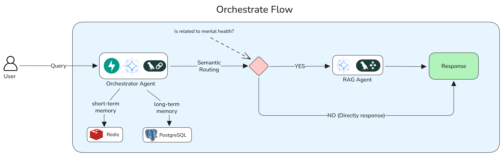

# Orchestrator Agent: The Central System of the Mental Health Support Platform

## Abstract

This document details the architectural design and implementation of the Orchestrator Agent, the primary interface and decision-making unit within our multi-agent mental health support system. Acting as the central nervous system, the Orchestrator Agent is responsible for intent classification, context management, and the intelligent routing of user queries. It distinguishes between general conversational inputs (chitchat) and domain-specific requests requiring professional knowledge, seamlessly delegating the latter to a specialized RAG (Retrieval-Augmented Generation) Agent while maintaining a coherent and empathetic user experience.

## 1. Introduction

In complex multi-agent systems, a single entry point is crucial for managing user interactions and maintaining conversation state. The Orchestrator Agent fulfills this role, abstracting the underlying complexity of specialized sub-agents from the user. By leveraging a Large Language Model (LLM) as a reasoning engine, it dynamically evaluates each user input to determine the most appropriate response strategy—whether to respond directly with empathy or to consult a knowledge-rich backend.

## 2. System Architecture

The Orchestrator Agent operates as a high-level supervisor, integrating with an LLM for reasoning and an Agent-to-Agent (A2A) client for downstream communication.

### 2.1. Workflow Visualization

The following diagram illustrates the decision-making flow within the Orchestrator Agent:



### 2.2. Core Components

- **Reasoning Engine (LLM)**: Powered by Google's Gemini Pro (`gemini-pro`), this component analyzes user input against a sophisticated system prompt to determine intent.
- **A2A Client (`RAGAgentA2AClient`)**: A specialized client implementing the Agent-to-Agent protocol, enabling standardized communication with the downstream RAG Agent.
- **Prompt Manager**: Manages the `ROOT_INSTRUCTION` and dynamic context injection (chat history), ensuring the LLM makes informed decisions.

## 3. Methodology: The Orchestration Logic

The core intelligence of the agent lies in its two-step processing pipeline: Intent Classification and Dynamic Routing.

### 3.1. Intent Classification

Upon receiving a message, the Orchestrator Agent utilizes a structured prompt (defined in `root_prompt.py`) to categorize the user's intent into one of two primary streams:

1.  **General Interaction (Chitchat/Support)**: Inputs related to greetings, simple emotional validation, or general conversation.
    - _Action_: The Orchestrator generates a direct, empathetic response.
2.  **Domain-Specific Inquiry (Mental Health)**: Inputs requiring specific psychological knowledge, advice on coping mechanisms, or explanations of symptoms (e.g., "What are the signs of depression?", "How do I deal with exam stress?").
    - _Action_: The Orchestrator identifies the need for external knowledge and selects the "RAG Agent".

### 3.2. Dynamic Routing and JSON Decisioning

To enforce strict control over the routing process, the LLM is instructed to output its decision in a strict JSON format:

```json
{
    "selected_agent": "RAG Agent" | null,
    "response": "...",
    "sources": [...]
}
```

- **If `selected_agent` is `null`**: The system returns the `response` field directly to the user.
- **If `selected_agent` is `"RAG Agent"`**: The system suspends the direct response and triggers the `A2AClient` to forward the user's query to the RAG Agent. The result from the RAG Agent (including content and citations) is then returned to the user.

### 3.3. Agent-to-Agent (A2A) Communication

The system implements a robust A2A protocol to decouple the Orchestrator from the RAG Agent's implementation details. The `RAGAgentA2AClient` resolves the RAG Agent's endpoint via a standard `.well-known/agent-card.json` discovery mechanism, ensuring that the Orchestrator can dynamically adapt to changes in the downstream agent's location or capabilities.

## 4. Implementation Details

The agent is implemented in Python, utilizing the LangChain framework for LLM abstraction and prompt management.

- **Class Structure**:
  - `OrchestratorAgent`: The main class encapsulating the initialization of the LLM and A2A client, and the `process_message` loop.
  - `RAGAgentA2AClient`: Handles the HTTP/REST communication with the RAG service, including streaming and non-streaming modes.
- **Configuration**: Managed via `config.py`, allowing for environment-based tuning of LLM parameters (temperature, max tokens) and service URLs.

## 5. Conclusion

The Orchestrator Agent successfully solves the problem of "agent sprawl" by providing a unified, intelligent interface for the user. By effectively separating conversational duties from knowledge retrieval tasks, it ensures that the system remains both responsive and accurate. This architecture allows for future scalability, where additional specialized agents (e.g., a Crisis Intervention Agent or a Scheduling Agent) can be integrated simply by updating the Orchestrator's routing logic.
