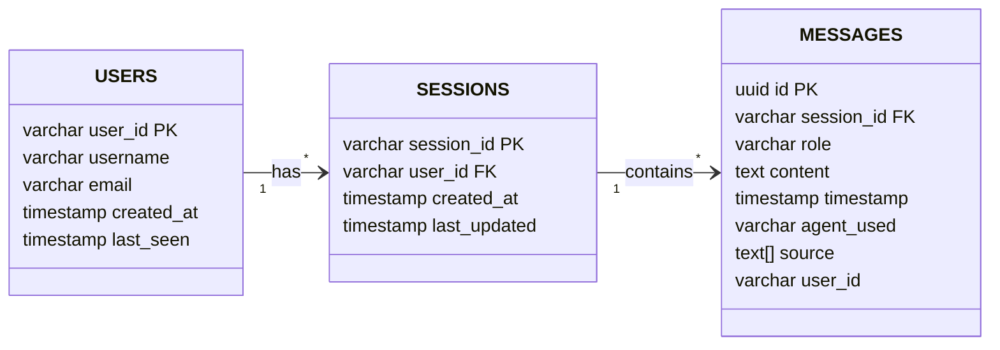

# Database Schema Diagram

## Description

### Table: `users`
Stores user information.
- **user_id**: Unique identifier for the user.
- **username**: Display name of the user.
- **email**: Email address of the user.
- **created_at**: When the user was first seen.
- **last_seen**: When the user was last active.

### Table: `sessions`
Stores metadata about chat sessions.
- **session_id**: Unique identifier for the session.
- **user_id**: Links the session to a specific user in the `users` table.
- **created_at**: When the session started.
- **last_updated**: When the last activity occurred.

### Table: `messages`
Stores individual messages within a session.
- **id**: Unique UUID for the message.
- **session_id**: Links the message to a specific session in the `sessions` table.
- **role**: The sender of the message (`user` or `assistant`).
- **content**: The actual text of the message.
- **timestamp**: When the message was sent.
- **agent_used**: Which agent generated the response (for assistant messages).
- **source**: Array of source references (if RAG was used).
- **user_id**: Redundant but useful for quick user-level queries.
