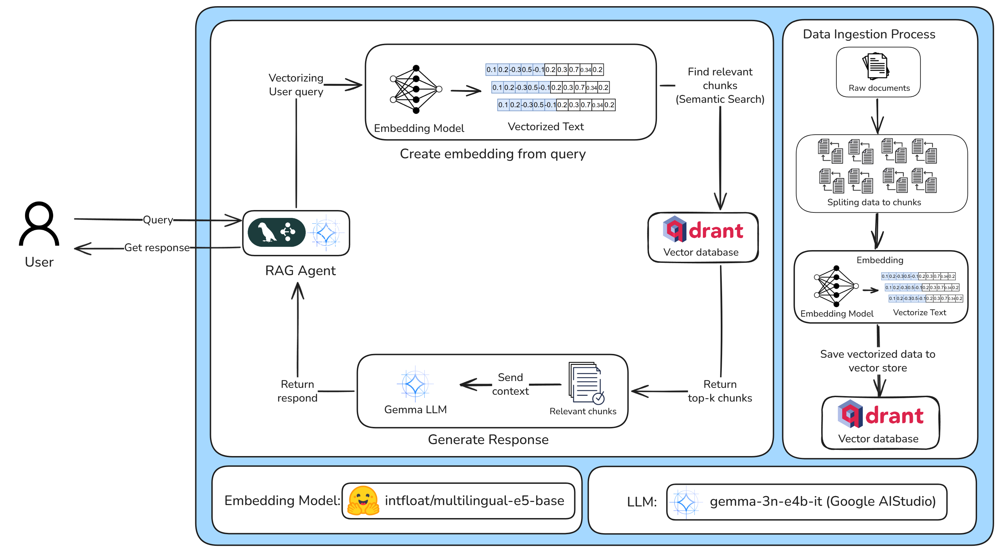
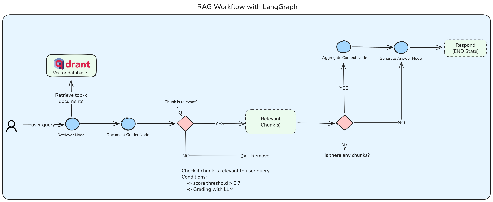

# Mental Health RAG Agent: Technical Architecture and Workflow

## Abstract

This document details the technical architecture and operational workflow of the **Mental Health RAG Agent**, a specialized Retrieval-Augmented Generation system designed to provide empathetic, context-aware mental health counseling support. Built upon the **LangGraph** framework, this agent integrates **Google's Gemini LLM** for generation, **HuggingFace** models for multilingual embeddings, and **Qdrant** for vector storage. The system features a robust multi-stage pipeline—including semantic retrieval, LLM-based relevance grading, and safety-aligned response generation—to ensure high-quality, safe, and supportive interactions for students and individuals seeking guidance.

## 1. Introduction

In the domain of automated mental health support, the challenge lies in balancing the accuracy of information with the nuance of empathetic communication. Traditional rule-based chatbots often lack context, while pure LLM approaches risk hallucination or insensitivity. This RAG Agent addresses these challenges by grounding generative capabilities in a curated knowledge base (processed via the Data Preparation pipeline) and employing a state-based graph architecture to strictly control the flow of information and ensure response safety.

## 2. System Architecture

The agent operates as a microservice, utilizing a modular architecture orchestrated by **LangGraph**.



### 2.1. Core Components

-   **Large Language Model (LLM)**: `google_genai` (default: `gemma-3n-e4b-it`). Chosen for its reasoning capabilities and efficiency in processing structured prompts.
-   **Embedding Model**: `intfloat/multilingual-e5-base`. Selected for its superior performance in semantic similarity tasks across multiple languages, including Vietnamese.
-   **Vector Database**: **Qdrant**. Stores vectorized knowledge chunks with payload metadata for efficient retrieval.
-   **Orchestrator**: **LangGraph**. Manages the stateful execution flow, allowing for complex logic like conditional branching and error handling.

### 2.2. Agent Workflow (LangGraph)

The agent's logic is encapsulated in a `StateGraph` that defines the lifecycle of a user query. The workflow consists of four primary nodes executed sequentially:



1.  **Retrieve Documents (`retrieve_documents`)**:
    -   **Input**: User query.
    -   **Process**: The query is vectorized using the embedding model. A cosine similarity search is performed against the Qdrant `mental_health_advisor` collection.
    -   **Configuration**: Retrieves `TOP_K` documents (default: 5) exceeding a `SIMILARITY_THRESHOLD` (default: 0.7).
    -   **Output**: A list of raw candidate documents.

2.  **Filter Documents (`filter_documents`)**:
    -   **Process**: Implements a "Retrieval Grader" pattern. The LLM evaluates each retrieved document against the user query to determine relevance ("YES" or "NO").
    -   **Logic**: 
        -   If the LLM confirms relevance (`YES`), the document is kept.
        -   If irrelevant (`NO`), it is discarded.
        -   **Fallback**: If the LLM's grading is ambiguous, the system defaults to keeping the document based on its high vector similarity score.
    -   **Goal**: Reduces noise and hallucination by ensuring only truly relevant context reaches the generation phase.

3.  **Aggregate Context (`aggregate_context`)**:
    -   **Process**: Concatenates the content of valid documents into a single formatted string, preserving source metadata (Source file, Chunk index).
    -   **Output**: A structured context block ready for injection into the system prompt.

4.  **Generate Answer (`generate_answer`)**:
    -   **Process**: Synthesizes the final response using the LLM.
    -   **Prompt Engineering**: The system uses a specialized prompt that instructs the model to act as a "School Psychologist/Mental Health Advisor".
    -   **Safety & Ethics**:
        -   **Crisis Intervention**: Explicit instructions to detect self-harm or crisis signals and provide immediate safety resources.
        -   **Non-Clinical Stance**: Strictly forbids medical diagnosis.
        -   **Tone**: Enforces an empathetic, supportive, and non-judgmental tone suitable for student counseling.

## 3. Implementation Details

### 3.1. State Management (`RAGState`)

The agent maintains a typed state (`RAGState`) throughout the execution, tracking:
-   `query`: Original user input.
-   `retrieved_documents`: Raw search results.
-   `relevant_documents`: Filtered, high-quality results.
-   `context`: The aggregated context string.
-   `answer`: The generated response.
-   `status` & `error`: Operational metadata for monitoring.

### 3.2. Safety Protocols

A critical requirement for mental health AI is safety. The `generate_answer` node incorporates a safety layer within the prompt:
> "Nếu câu hỏi có dấu hiệu khẩn cấp (liên quan đến tự hại, tự tử, bạo lực...), hãy ưu tiên **an toàn**..."

This ensures that even if the retrieved context is neutral, the final output prioritizes human safety when risk is detected.

## 4. Configuration & Deployment

The agent is configured via environment variables (`.env`) or the `Config` class:

| Variable | Description | Default |
|----------|-------------|---------|
| `GOOGLE_API_KEY` | API Key for Gemini LLM | Required |
| `GOOGLE_LLM_MODEL` | Model version | `gemma-3n-e4b-it` |
| `QDRANT_URL` | Vector DB Endpoint | `http://localhost:6333` |
| `COLLECTION_NAME` | Qdrant Collection | `mental_health_advisor` |
| `EMBEDDING_MODEL` | HuggingFace Model Path | `intfloat/multilingual-e5-base` |
| `TOP_K_DOCUMENTS` | Retrieval Count | 5 |
| `SIMILARITY_THRESHOLD` | Vector Similarity Cutoff | 0.7 |

### Running the Agent

The agent is designed to run as a service or standalone module.

```bash
# Activate environment
uv venv
source .venv/bin/activate

# Install dependencies
uv sync

# Run the agent
uv run .
```

## 5. Conclusion

The Mental Health RAG Agent represents a sophisticated application of the RAG pattern, moving beyond simple "retrieve-and-generate" to a "retrieve-grade-generate" workflow. By incorporating an LLM-based filtering step and strict prompt engineering for safety, it delivers a reliable, context-aware, and empathetic conversational interface for mental health support. Its modular design allows for seamless component upgrades (e.g., switching embedding models or LLMs) while maintaining the integrity of the counseling workflow.

