# Data Preparation Pipeline for Mental Health RAG System: A Technical Analysis

## Abstract

This document presents a comprehensive technical analysis of the data preparation pipeline designed for a Retrieval-Augmented Generation (RAG) system focused on mental health counseling for students. The pipeline automates the ingestion, processing, vectorization, and storage of unstructured PDF documents. Key features include specialized text preprocessing for Vietnamese content, robust chunking strategies preserving semantic context, and an optimized vector storage schema using Qdrant.

## 1. Introduction

The effectiveness of a RAG system heavily relies on the quality of its knowledge base. For a domain as sensitive as mental health, ensuring data accuracy, context preservation, and efficient retrieval is paramount. This data preparation phase serves as the foundation for the RAG agent, transforming raw PDF consultation materials into high-dimensional vector representations suitable for semantic search.

## 2. Methodology

The data preparation process is modularized into three core components: Document Processing, Embedding Generation, and Vector Storage management.

### 2.1. Document Processing and Chunking (`PDFProcessor`)

The `PDFProcessor` module is responsible for transforming raw PDF files into structured text chunks.

- **Text Extraction**: Utilizes `PyPDF2` to extract text from PDF pages.
- **Vietnamese Text Normalization**: A specialized `clean_vietnamese_text` method is implemented to handle encoding issues common in Vietnamese PDFs. It performs:
  - Removal of null and control characters.
  - Normalization of whitespace and newlines.
  - Standardization of Vietnamese punctuation (e.g., spacing around commas, dots).
  - Removal of headers/footers and page numbers (e.g., "Trang 1", "Page 1") to prevent irrelevant metadata from polluting the context.
- **Section Extraction**: The system attempts to identify document structure by extracting section headers (e.g., "CHƯƠNG 1", "Phần I", "1. Introduction") using regex patterns. This metadata is attached to chunks to provide context.
- **Chunking Strategy**: The `RecursiveCharacterTextSplitter` from LangChain is employed with a hierarchical list of separators (`\n\n\n`, `\n\n`, `\n`, `. `, etc.). This ensures that text is split at semantically meaningful boundaries (paragraphs, sentences) rather than arbitrary character counts.
  - _Configuration_: `CHUNK_SIZE` and `CHUNK_OVERLAP` are configurable (defined in `Config`), allowing for tuning based on the embedding model's context window.

### 2.2. Vectorization and Embedding (`EmbeddingManager`)

The `EmbeddingManager` handles the conversion of text chunks into vector representations.

- **Model Selection**: The system uses `SentenceTransformer` models, specifically chosen for their performance on Vietnamese text or multilingual capabilities (configured via `Config.EMBEDDING_MODEL`).
- **Preprocessing**: Before embedding, text undergoes cleaning to remove non-printable characters and normalize whitespace. Crucially, a truncation mechanism is implemented to handle texts exceeding the model's maximum context length (typically 512 tokens), ensuring robust processing without errors.
- **Batch Processing**: To optimize throughput, embeddings are generated in batches (`Config.EMBEDDING_BATCH_SIZE`). The system includes error handling and fallback mechanisms:
  - If a batch fails, it retries with a smaller batch size (down to 1).
  - Invalid or empty texts are filtered out to prevent model errors.
- **Quality Assurance**: A `test_embedding_quality` method is included to validate the model's performance on domain-specific queries (e.g., "triệu chứng trầm cảm") against sample documents, ensuring the semantic similarity logic holds.

### 2.3. Vector Storage (`QdrantManager`)

The `QdrantManager` orchestrates interactions with the Qdrant vector database.

- **Collection Configuration**: Collections are created with specific optimizations for retrieval accuracy and performance:
  - **Distance Metric**: Cosine similarity is used, which is standard for semantic text retrieval.
  - **HNSW Index**: Hierarchical Navigable Small World (HNSW) parameters (`m=16`, `ef_construct=100`) are tuned to balance indexing speed, memory usage, and search recall.
  - **On-Disk Storage**: Vectors can be configured to be stored on disk (`on_disk=True`) to reduce RAM usage for large datasets.
- **Metadata Storage**: Each vector is stored with a rich payload containing:
  - `content`: The actual text chunk.
  - `source`: Filename of the source PDF.
  - `chunk_index`: Order of the chunk in the document.
  - `section`: Extracted section header.
  - `doc_id`: Unique identifier for the source document.
- **Search Capabilities**: The manager supports semantic search with filtering capabilities (by source or section) and configurable score thresholds to filter out irrelevant results.

## 3. System Architecture

The `ingest_data.py` script acts as the orchestrator, tying these components together in a linear pipeline:

```mermaid
graph LR
    Start([Start]) --> Prereq{Check Prerequisites}
    Prereq -- Fail --> End([Exit])
    Prereq -- Pass --> FindPDF[Find PDF Files]

    FindPDF --> Found{Files Found?}
    Found -- No --> End
    Found -- Yes --> Analyze[Analyze Content]

    Analyze --> Readable{Readable?}
    Readable -- No --> End
    Readable -- Yes --> Process[Process PDFs]

    subgraph "Document Processing"
        Process --> Extract[Extract Text]
        Extract --> Clean[Clean Vietnamese Text]
        Clean --> Sections[Extract Sections]
        Sections --> Chunk[Chunk Text]
    end

    Chunk --> Embed[Create Embeddings]

    subgraph "Vectorization"
        Embed --> Preprocess[Preprocess Text]
        Preprocess --> GenEmbed[Generate Embeddings]
        GenEmbed --> CheckEmbed{Success?}
        CheckEmbed -- No --> Retry[Retry]
        Retry --> GenEmbed
        CheckEmbed -- Yes --> ReturnEmbed[Return Embeddings]
    end

    ReturnEmbed --> Store[Store in Vector DB]

    subgraph "Storage"
        Store --> CreateCol[Create/Check Collection]
        CreateCol --> Upsert[Upsert Vectors]
    end

    Upsert --> Report[Reporting]
    Report --> End

    style Start fill:#f9f,stroke:#333,stroke-width:2px
    style End fill:#f9f,stroke:#333,stroke-width:2px
    style Prereq fill:#ff9,stroke:#333,stroke-width:2px
    style Found fill:#ff9,stroke:#333,stroke-width:2px
    style Readable fill:#ff9,stroke:#333,stroke-width:2px
    style CheckEmbed fill:#ff9,stroke:#333,stroke-width:2px
```



1.  **Prerequisite Check**: Verifies Qdrant connectivity and embedding model health.
2.  **Discovery**: Scans specified paths for PDF files.
3.  **Analysis**: Performs a dry-run analysis to ensure PDFs are readable before processing.
4.  **Processing**:
    - `PDFProcessor` converts PDFs -> Documents (Chunks).
    - `EmbeddingManager` converts Documents -> Embeddings.
    - `QdrantManager` uploads Embeddings -> Vector DB.
5.  **Reporting**: Provides detailed statistics on processed files, generated chunks, and database status.

## 4. Conclusion

This data preparation pipeline represents a robust, production-ready solution for the Mental Health RAG system. By integrating domain-specific preprocessing for Vietnamese text, fault-tolerant batch processing for embeddings, and optimized vector storage configurations, it ensures that the downstream RAG agent has access to a high-quality, semantically rich knowledge base. The modular design allows for easy upgrades to individual components (e.g., swapping embedding models or changing chunking strategies) without disrupting the overall workflow.

## 5. Usage Instructions

To run the data ingestion pipeline, follow these steps:

1.  **Prerequisites**: Ensure you have `uv` installed and the Qdrant service is running.
2.  **Environment**: The script uses `uv` for dependency management.
3.  **Run Script**: Execute the following command from the `src/data-preparing` directory:

```bash
uv venv
source .venv/bin/activate
uv run ingest_data.py
```

This command will automatically handle dependency installation and execute the ingestion script using the default configuration (processing PDFs in the `data` directory).

### Additional Options

- **Specify PDF/Folder**: `uv run ingest_data.py path/to/file.pdf` or `uv run ingest_data.py path/to/folder/`
- **Clear Existing Collection**: `uv run ingest_data.py --clear`
- **Force Reprocess**: `uv run ingest_data.py --force`
- **Analyze Only**: `uv run ingest_data.py --analyze`
- **Check Prerequisites**: `uv run ingest_data.py --check`
